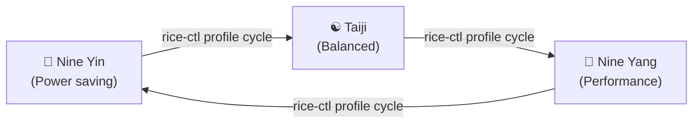

# Niri Rice — 3-Day Development & Evolution Summary
**Dates Covered:** September 11, 2026 – September 14, 2026  
**Target Repository:** `/mnt/shared/stuff/projects/niri-rice`  
**Current Branch:** `master` (Ahead of origin by 15 commits, 60 total commits in period)

---

## 1. Executive Overview

Over the past three days, the **Niri Rice** environment underwent a massive transformation across performance, visual consistency, hardware ergonomics, and window management:
- **Core Architecture:** Legacy shell and Python scripts were entirely deprecated and replaced by a unified, high-performance native Rust controller (`rice-ctl` v2.0.0).
- **Power & System States:** A philosophically coherent, three-state power profile system was designed around Daoist internal martial arts (**Nine Yin**, **Taiji**, and **Nine Yang**), deeply integrated with ACPI power profiles, Waybar indicators, and Kando pie menus.
- **Notification Center:** The notification indicator on Waybar was transformed from a passive hide-on-empty indicator into an **always-visible notification hub** offering quick-action toggles for Do Not Disturb (DND) and an interactive Rofi notification history viewer.
- **Radial Workflow:** Kando pie menus were embedded with sub-5ms WebSocket IPC, customized with Material 3 Expressive styling, streamlined navigation, and mouse-bound execution.
- **Aesthetic Synchronization:** Material You (Matugen) dynamic theming was extended deep into the Qt/KDE ecosystem, bringing real-time wallpaper color syncing to **Dolphin file manager** and its **embedded Konsole terminal**, alongside Kitty, Btop, Mako, and SDDM.
- **Hardware & Ergonomics:** Touchpad palm rejection (DWT) and I2C power-management bugs were resolved, and mouse side buttons on the Razer DeathAdder V2 X HyperSpeed were bound to the HUD and dropterm scratchpad.

---

## 2. Core Controller: `rice-ctl` Native Rust Migration

The legacy codebase contained scattered shell scripts (`caf.sh`, `dnd-toggle.sh`, `barsel.sh`, `yazi-note.sh`, etc.) and Python helpers that caused process overhead and inconsistent state management.

### Key Capabilities Introduced in `rice-ctl`:
1. **Unified CLI Suite:** Replaced all standalone scripts with subcommands (`rice-ctl profile`, `rice-ctl dnd`, `rice-ctl history`, `rice-ctl scratchpad`, `rice-ctl bg-apps`, `rice-ctl volume`, etc.).
2. **Native Window Swallowing:**
   - Detects child GUI processes launched from terminals and automatically hides the parent terminal while the GUI is open.
   - Includes **process tree ancestor climbing** with **Tmux pane client tracing**, allowing seamless swallowing even inside nested Tmux sessions.
3. **Directional Scratchpad Manager:**
   - **Dropterm Scratchpad (`float.dropterm`):** Spawns or toggles a persistent terminal automatically attached to the user's main Tmux session (`tmux new-session -A -s main`).
   - **Calculator Scratchpad (`float.calc`):** Re-engineered to deploy from the left edge (`direction: FromLeft`) with compact default geometry (`width_ratio: 0.20`, `height_ratio: 0.38`).
4. **Interactive Notification History (`rice-ctl history`):**
   - Interrogates `makoctl list -j` and `makoctl history -j`.
   - Formats urgency, app name, summary, and body into an interactive Rofi menu with a one-click "Clear All Notifications" action.

---

## 3. Power Profile Management: Nine Yin, Taiji & Nine Yang

The power profile subsystem was completely overhauled, evolving through sect names to ultimate martial arts, and finally to the classic Daoist internal triad:

### Profile Specifications:

| Profile | Philosophy & Energy State | ACPI Platform Profile | Systemd Inhibit (Caffeine) | Waybar Indicator | Kando Icon & Key |
| :--- | :--- | :--- | :--- | :--- | :--- |
| **Nine Yin** *(九陰)* | Supreme Yin energy, deep conservation of vital qi, absolute stillness | `low-power` | Disabled (Auto-sleep permitted) | `󰜗 nine yin` *(ice crystal)* | `ac_unit` (<kbd>s</kbd>) |
| **Taiji** *(太極)* | Perfect equilibrium, dynamic harmony between Yin & Yang | `balanced` | Disabled (Auto-sleep permitted) | `☯ taiji` *(yin-yang)* | `balance` (<kbd>t</kbd>) |
| **Nine Yang** *(九陽)* | Pure blazing Yang energy, inexhaustible vitality, peak performance | `performance` | **Active** (Sleep, idle & lid-switch inhibited) | `󰈸 nine yang` *(fire)* | `local_fire_department` (<kbd>p</kbd>) |

- **Real-Time Cycling:** Clicking the Waybar module or running `rice-ctl profile cycle` immediately shifts hardware state and dispatches real-time signals (`RTMIN+13` and `RTMIN+2`) to redraw Waybar widgets without compositor lag.
- **Robust Aliases:** Full backward compatibility retained in `rice-ctl` for legacy names (`sipping`, `sleep-on`, `caffeinated`, `shaolin`, `wudang`, `mount-hua`, `yi-jin-jing`, `plum-blossom-sword`).

---

## 4. Waybar & Desktop Status Modules

1. **Always-Visible Notification Center (`custom/dunst`):**
   - Previously hid when DND was inactive. Now continuously visible to serve as a notification control hub.
   - Shows `󰂚` when notifications are active; dynamically switches to `󰂛` with high-visibility accent styling when DND is enabled.
   - **Click Actions:**
     - **Left-Click:** Launches interactive notification history (`rice-ctl history`).
     - **Right-Click:** Toggles Do Not Disturb (`rice-ctl dnd toggle`).
     - **Middle-Click:** Dismisses all active notifications (`makoctl dismiss -a`).
2. **Background Apps Drawer (`custom/bg-apps`):**
   - Added a collapsible system tray widget displaying a minimal `<` or `>` indicator.
   - Auto-detects running background apps (Discord/Vesktop, Spotify, Steam) and displays their icons when expanded.
3. **Purged "Nuke" Theme:**
   - Completely eradicated the legacy "nuke" waybar theme and references from Waybar configs and theme pickers.
4. **Compositor Stability:**
   - Daemonized Waybar with `setsid` on color reload to prevent SIGUSR2 crashes during dynamic theme switching.

---

## 5. Kando Radial HUD & Pie Menu System

1. **Architecture & Transport:**
   - Integrated Kando with a sub-5ms local WebSocket IPC daemon.
   - Fixed Wayland compositor focus delegation to guarantee that opening Kando immediately captures input focus.
2. **Streamlined Navigation:**
   - **Main Menu:** Purged redundant actions (Overview, Close Window, Fullscreen) for a tighter, cleaner radial layout.
   - **Profiles Submenu:** Replaced generic options with the **Nine Yin / Taiji / Nine Yang** triad with rapid single-key quick-select keys (<kbd>s</kbd>, <kbd>t</kbd>, <kbd>p</kbd>).
   - **Networks Submenu:** Cleaned up to retain only vital entries: SSH (<kbd>Super</kbd>+<kbd>Alt</kbd>+<kbd>S</kbd>), Network Settings, and `PESU-WIFI`.
3. **Visual Styling:**
   - Applied Material 3 Expressive theming with Google Material Symbols (`ac_unit`, `balance`, `local_fire_department`, `wifi`, `dns`).

---

## 6. Input, Keybindings & Hardware Tuning

1. **Mouse Side Buttons (Razer DeathAdder V2 X HyperSpeed):**
   - Configured in `~/.config/niri/config.kdl`:
     - **Forward Side Button (`MouseForward` / Button 9):** Triggers the Kando Main Radial Menu.
     - **Back Side Button (`MouseBack` / Button 8):** Toggles the Dropterm terminal scratchpad.
2. **Keybinding Conflict Resolutions:**
   - **Restored Tiling Toggle:** Returned <kbd>Mod</kbd>+<kbd>Space</kbd> to `toggle-column-tabbed-display`.
   - **Kando HUD Binding:** Rebound to <kbd>Mod</kbd>+<kbd>Grave</kbd> (<kbd>`</kbd> / <kbd>~</kbd>).
   - **Window Floating:** Rebound to <kbd>Mod</kbd>+<kbd>Shift</kbd>+<kbd>Space</kbd>.
3. **Touchpad Palm Rejection (DWT Fix):**
   - `keyd` virtual keyboard was previously identified as an external keyboard, causing libinput to disable palm rejection.
   - Marked `keyd` as an internal keyboard in Niri input rules, re-enabling Disable-While-Typing (DWT).
4. **I2C Power Management Fix:**
   - Resolved touchpad freeze/stutter on battery by disabling aggressive runtime PM autosuspend on the AMD I2C controller and ELAN touchpad.
5. **Power Management Tuning:**
   - Migrated primary background power regulation to **TLP**, reserving PowerTOP strictly for diagnostic measurements.

---

## 7. Dynamic Theming: Matugen & KDE Ecosystem

1. **Dolphin & KDE Palette Sync:**
   - Built an automated sync mechanism linking Matugen palette generation to `kdeglobals` and `dolphinrc`.
   - Dolphin now dynamically inherits accent, surface, and text colors matching the active wallpaper.
2. **Dolphin Embedded Konsole:**
   - Configured `~/.local/share/konsole/Matugen.colorscheme` to dynamically update whenever Matugen regenerates colors, keeping the terminal inside Dolphin visually identical to standalone Kitty.
3. **Terminal Palette Overhaul:**
   - Migrated default terminal from Foot to **Kitty**.
   - Harmonized ANSI 16-color palette matching the End-4 rice standard with rich 256-color ramp retention.
4. **Lockscreen & SDDM:**
   - SDDM Qt6 login theme styled with Veila-styled Material You dynamic colors.
   - Minimalist lockscreen layout positioning date/time and password prompt in cleanly balanced screen corners.
5. **Btop System Monitor:**
   - Integrated dynamic color generation into `.config/btop/themes/matugen.theme`.

---

## 8. Terminal, Tmux & Editor Workflow

1. **Universal Default Editor:**
   - Set **Neovim (`nvim`)** as the universal default editor across environment variables (`EDITOR`, `VISUAL`), mime associations, and launcher menus (replacing Kate).
2. **Tmux Refinements:**
   - Fixed instant context menu dismissal on mouse click by binding to `MouseUp3Pane`.
   - Added <kbd>Ctrl</kbd>+<kbd>Tab</kbd> for rapid pane cycling and <kbd>Ctrl</kbd>+<kbd>W</kbd> for window closing.
   - Enabled OSC 8 hyperlink recognition for clickable web and file links in terminal logs and CLI tools.
   - Fixed `-ga` session environment option warnings on startup.

---

## 9. Comprehensive Git Commit History (Past 3 Days)

| Commit Hash | Date | Category | Summary |
| :--- | :---: | :--- | :--- |
| `9cff6fa` | 2026-09-14 | `feat(bar)` | Make notification bell always visible with history launcher; update Nine Yin to ice crystal and Nine Yang to fire |
| `188de9b` | 2026-09-14 | `feat(power)` | Rename profiles to Nine Yin, Taiji, and Nine Yang with simplified descriptions |
| `0a8c616` | 2026-09-13 | `fix(dnd)` | Signal waybar on dnd toggle |
| `a9b23c8` | 2026-09-13 | `feat(power)` | Rename profiles to ultimate martial arts (Yi Jin Jing, Taiji, Plum Blossom Sword) |
| `33c457b` | 2026-09-13 | `feat(power)` | Configure Shaolin, Wudang, and Mount Hua Murim sect power profiles |
| `f0f1773` | 2026-09-13 | `fix(power)` | Replace snowflake icon with Shaolin Buddhist palm salute icon |
| `3305eb9` | 2026-09-13 | `feat(rice)` | Add mouse side binds, compact left calc scratchpad, and Murim power profiles |
| `8f24004` | 2026-09-13 | `feat(power)` | Rename balanced power profile from sleep-on to taiji |
| `d34dd5d` | 2026-09-13 | `feat(dolphin)`| Sync embedded Konsole terminal color scheme with Matugen |
| `f9d27a1` | 2026-09-13 | `feat(kde)` | Sync Dolphin and KDE color scheme with Matugen |
| `724c9d0` | 2026-09-13 | `feat` | Add 3-mode profile manager, tmux dropterm session, nvim code editor, and pesu-wifi network menu |
| `1b0b16e` | 2026-09-13 | `refactor` | Purge nuke waybar theme and streamline window menu |
| `fa36f3a` | 2026-09-13 | `feat(kando)` | Add multi-menu shortcuts, quick-select keys, and fix binary targets |
| `50dfbe9` | 2026-09-13 | `feat(kando)` | Enforce active compositor focus on menu open |
| `39968e4` | 2026-09-13 | `perf` | Add instant 5ms WebSocket trigger and fullscreen window management |
| `c1f9062` | 2026-09-13 | `fix(waybar)`| Resolve background apps drawer toggle and render '<' / '>' |
| `4e05f04` | 2026-09-13 | `feat(swallow)`| Add tmux pane client tracing to process ancestor climber |
| `0879e65` | 2026-09-13 | `feat(core)` | Implement native window swallowing and directional floating scratchpads |
| `4602d30` | 2026-09-13 | `fix(niri)` | Restore Mod+Space tiling toggle, rebind Kando to Mod+Grave, fix PATH |
| `733c817` | 2026-09-13 | `fix(waybar)`| Add native background app detection for Discord/Spotify/Steam and hide redundant applets |
| `cadb4fc` | 2026-09-13 | `docs` | Add comprehensive Kando Radial HUD and M3 Expressive guide |
| `619d920` | 2026-09-13 | `feat(desktop)`| Add Kando application desktop entry |
| `d073378` | 2026-09-13 | `fix(shortcuts)`| Resolve Mod+Space collision, move float to Mod+Shift+Space, delegate power menu |
| `c9b7cda` | 2026-09-13 | `feat(kando)` | Integrate kando radial hud, M3 expressive theme, and dynamic wifi |
| `69c2943` | 2026-09-13 | `feat(bar)` | Move bg apps to left of battery and modernize powermenu with Material 3 icons |
| `0841f85` | 2026-09-13 | `feat(waybar)`| Add background apps drawer widget with toggle indicator |
| `544d086` | 2026-09-13 | `fix(input)` | Mark keyd virtual keyboard as internal to fix Disable-While-Typing (DWT) |
| `517506b` | 2026-09-13 | `feat(editor)`| Set neovim as universal default editor instead of kate |
| `bb55bed` | 2026-09-13 | `refactor` | Use TLP for dynamic power management and reserve PowerTOP for diagnostics |
| `c9a0aea` | 2026-09-13 | `fix(touchpad)`| Prevent runtime PM autosuspend on AMD I2C controller and ELAN touchpad |
| `1a2db84` | 2026-09-13 | `fix(tmux)` | Trigger right-click menu on MouseUp3Pane to prevent instant dismissal |
| `957229a` | 2026-09-13 | `feat(sddm)` | Add bespoke Veila-styled SDDM Qt6 theme with dynamic wallpaper and Matugen theming |
| `fd71790` | 2026-09-13 | `style(lock)` | Minimalist bottom-right with underline password bar and simplified clock |
| `1d125d8` | 2026-09-13 | `style(lock)` | Move datetime, user, and password to bottom-left and remove blur tile |
| `ce4057d` | 2026-09-13 | `fix(matugen)`| Daemonize waybar with setsid on reload |
| `ba035da` | 2026-09-13 | `fix(matugen)`| Safely restart waybar on color reload to avoid SIGUSR2 segfault |
| `044be79` | 2026-09-13 | `fix(matugen)`| Use veila reload in post_hook for seamless config reload |
| `60cf54d` | 2026-09-13 | `feat(lock)` | Replace hyprlock with Veila + Matugen color template |
| `9108eb7` | 2026-09-13 | `fix(tmux)` | Use -ga flag for session option update-environment to eliminate startup error |
| `6fdb5c2` | 2026-09-12 | `fix(theme)` | Restore terminal 256-color ramp, high-contrast ANSI colors, and align Mako with Niri |
| `b3db17a` | 2026-09-12 | `feat(notif)` | Restore mako with rofi history menu, eradicate swaync, and bind ctrl+w to close tmux tabs |
| `2d151be` | 2026-09-12 | `fix(swaync)` | Disable layer-shell-cover-screen and remove control-center blur rule |
| `fbbf5ec` | 2026-09-12 | `feat(theme)` | Configure btop with dynamic Material You colors via Matugen |
| `bee2523` | 2026-09-12 | `fix(desktop)`| Eliminate fullscreen blur, restore original Waybar, and fix Control Center layout |
| `a2d7484` | 2026-09-12 | `feat(widgets)`| Implement SwayNC Material You Control Center and Waybar Dynamic Island |
| `ce9767c` | 2026-09-12 | `chore` | Purge foot terminal configs, lock accent retention, and clean codebase |
| `5eaf2e0` | 2026-09-12 | `feat(kitty)` | Reconfigure Matugen terminal palette matching end-4 rice with harmonized ANSI colors |
| `28094d6` | 2026-09-12 | `fix(tmux)` | Fix right-click menu persistence, clipboard pass-through, and process persistence |
| `d882f45` | 2026-09-12 | `feat(term)` | Make tmux links in AI CLI and general tools clickable |
| `e3a0b04` | 2026-09-12 | `feat(term)` | Migrate default terminal from foot to kitty with Matugen theming |
| `20c854f` | 2026-09-12 | `feat(m3)` | Replace qylock with bespoke Material You hyprlock & system-wide translucency |
| `b177027` | 2026-09-12 | `feat(term)` | Make Super+Return focus open terminal or spawn new terminal |
| `93dadde` | 2026-09-12 | `feat(rofi)` | Modernize rofi suite with glassmorphic themes & add tmux ctrl+tab support |
| `46968f3` | 2026-09-12 | `fix(niri)` | Use spawn-sh with ~/.local/bin/rice-ctl and set PATH in environment.d |
| `55fbe8f` | 2026-09-12 | `docs` | Remove horizontal rule line separators from README.md |
| `0e93735` | 2026-09-12 | `feat(core)` | Complete migration to unified native Rust rice-ctl v2.0.0 |
| `534bc76` | 2026-09-11 | `feat(core)` | Migrate wallpaper selector, power menu, and all desktop controls to pure Rust rice-ctl |
| `43fd3b9` | 2026-09-11 | `feat(core)` | Implement native Rust rice-ctl CLI to replace Python & Bash theming scripts |
| `94a95ac` | 2026-09-11 | `fix(theme)` | Resolve matugen template symlink, add SIGUSR2 waybar hook, and dynamic rofi alpha |
| `c78bcc8` | 2026-09-11 | `feat(theme)` | Migrate from pywal to matugen Material You palette generator |
