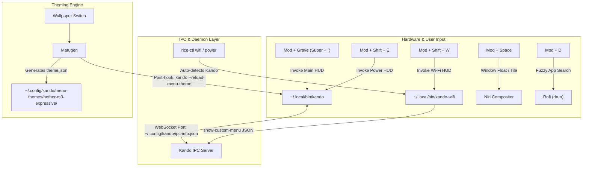

# Kando Radial HUD & Material 3 Expressive Guide

A comprehensive technical and user guide for the **Kando Radial Pie Menu** built from source, styled with Google's **Material 3 Expressive Android** design system, connected to **Matugen** dynamic wallpaper theming, and integrated with a native **WebSocket IPC Wi-Fi** manager in Niri.

---

## 📑 Table of Contents
1. [System Architecture](#system-architecture)
2. [Source Compilation & Packaging](#source-compilation--packaging)
3. [Material 3 Expressive Android Styling](#material-3-expressive-android-styling)
4. [Dynamic Matugen Color Scheme Pipeline](#dynamic-matugen-color-scheme-pipeline)
5. [Native Dynamic Wi-Fi Radial Menu (`kando-wifi`)](#native-dynamic-wi-fi-radial-menu-kando-wifi)
6. [8-Direction Radial Menu Layout](#8-direction-radial-menu-layout)
7. [System Shortcuts & Compositor Integration](#system-shortcuts--compositor-integration)
8. [File & Configuration Index](#file--configuration-index)
9. [CLI Commands & Verification](#cli-commands--verification)
10. [Customization & Extension](#customization--extension)

---

## 1. System Architecture

The desktop uses a **Hybrid Radial HUD + Fuzzy Finder** architecture:
- **Radial Pie Menus (Kando):** Applied for *bounded, low-entropy actions* (Power, Media, System Profiles, Top Apps, Quick Tools). Leverages Fitts's Law where targets have infinite depth and uniform angular distance, enabling ~150ms muscle-memory flicks without visual tracking.
- **Fuzzy Finders (Rofi):** Preserved exclusively for *unbounded, searchable datasets* (100+ application fuzzy search via `drun`, visual wallpaper thumbnail picker, clipboard history).



---

## 2. Source Compilation & Packaging

### Why Built from Source?
Upstream binary distributions do not natively account for colon-separated `XDG_CURRENT_DESKTOP` environments (such as `niri:KDE` configured in Pineapple's rice) and require native C++ addons compiled against the local system libraries.

### Source Directory
- **Path:** `/home/pineapple/.local/src/kando` (cloned on local `btrfs` native partition to preserve POSIX symlinks).

### Niri Backend Detection Patch
In `src/main/backends/index.ts`, desktop detection was enhanced:
```typescript
// Detect Niri even when XDG_CURRENT_DESKTOP contains colon-separated strings (e.g. "niri:KDE")
if (desktop.split(':').includes('niri')) {
  return new NiriBackend();
}
```

### Native Compilation & Packaging
1. Native node addons (`NativeWLR.node`, `NativeX11.node`) compiled using `Ninja` and `node-gyp`.
2. Packaged bundle created via `npm run package`.
3. Standalone output symlinked:
   ```bash
   ~/.local/bin/kando -> /home/pineapple/.local/src/kando/out/Kando-linux-x64/kando
   ```
4. Version verified: `3.0.0-beta.1`.

---

## 3. Material 3 Expressive Android Styling

The theme is installed at `~/.config/kando/menu-themes/nether-m3-expressive/` and implements Google's **Material 3 Expressive** design guidelines.

### Design Tokens & Physics
- **Capsule / Pill Geometry:** Radial slices expand into smooth M3 expressive pills (`border-radius: 9999px`) with dynamic padding and elevation.
- **Center Squircle FAB:** The center hub is styled as an M3 Large Floating Action Button with a continuous squircle curve (`border-radius: 28px`).
- **Emphasized Spring Physics:**
  ```css
  transition: all 0.25s cubic-bezier(0.2, 0.0, 0, 1.0);
  ```
  Hovering over slices applies an expressive spring bounce (`transform: scale(1.2)`).
- **Frosted Glassmorphism:**
  ```css
  backdrop-filter: blur(24px) saturate(180%);
  -webkit-backdrop-filter: blur(24px) saturate(180%);
  border: 1px solid var(--outline-variant);
  ```
- **Typography:** Configured with `PlusJakartaSans-Medium.ttf` at 13px weight for crisp legibility against dark translucent surfaces.

---

## 4. Dynamic Matugen Color Scheme Pipeline

Kando colors dynamically reflect your active wallpaper with zero daemon restarts.

### Matugen Template
Located at `~/.config/matugen/templates/kando-theme.json`:
```json
{
  "theme": "nether-m3-expressive",
  "dark": {
    "primary": "{{colors.primary.default.hex}}",
    "primary-container": "{{colors.primary_container.default.hex}}",
    "surface": "{{colors.surface.default.hex}}",
    "surface-container": "{{colors.surface_container.default.hex}}",
    "surface-container-high": "{{colors.surface_container_high.default.hex}}",
    "outline": "{{colors.outline.default.hex}}",
    "outline-variant": "{{colors.outline_variant.default.hex}}",
    "on-primary": "{{colors.on_primary.default.hex}}",
    "on-surface": "{{colors.on_surface.default.hex}}",
    "on-surface-variant": "{{colors.on_surface_variant.default.hex}}"
  }
}
```

### Automatic Reload Hook
In `~/.config/matugen/config.toml`:
```toml
[templates.kando]
input_path = "~/.config/matugen/templates/kando-theme.json"
output_path = "~/.config/kando/menu-themes/nether-m3-expressive/theme.json"
post_hook = "kando --reload-menu-theme 2>/dev/null || true"
```
Whenever a wallpaper is switched (via `rice-ctl theme select` or `rice-ctl theme rng`), Matugen generates the updated JSON and signals Kando to reload its palette instantly.

---

## 5. Native Dynamic Wi-Fi Radial Menu (`kando-wifi`)

Instead of opening a separate Rofi window, Wi-Fi is managed directly through Kando using dynamic WebSocket IPC.

### Architecture
- **Script:** `/home/pineapple/.local/bin/kando-wifi` (Node.js)
- **IPC Discovery:** Reads port number and API token from `~/.config/kando/ipc-info.json`.
- **Command:** Transmits a `{ type: 'show-custom-menu', menu: <RootMenuItem> }` payload over `ws://127.0.0.1:<port>`.

### Radial Layout
```
                 [󰤨 Strongest SSID 1]
                          |
   [󰤨 SSID 5]            |            [󰤨 SSID 2]
             \            |            /
              \           |           /
  [󰤮 Disconnect] --- ( 󰤨 Active ) --- [󰤨 SSID 3]
              /       ( Connection )   \
             /            |           \
     [󰖪 Turn Off]        |            [󰤨 SSID 4]
                          |
                  [󰒓 Wi-Fi Settings]
```

- **Center Hub:** Shows the current connection status and active SSID (`󰤨 My_WiFi` or `󰤮 Disconnected`).
- **Surrounding Slices (Top 5):** The strongest detected nearby networks, sorted by signal strength with dynamic signal icons (`󰤨`, `󰤥`, `󰤢`, `󰤟`) and security locks.
- **Instant Auto-Connect:** Saved/known networks connect immediately without prompts.
- **Floating `nmtui` Fallback:** Selecting an unsaved or protected network automatically spawns a centered floating terminal (`kitty --class kitty.nmtui -e nmtui`) for passphrase input.
- **Controller Delegation:** Running `rice-ctl wifi` detects if Kando is running and seamlessly delegates to `kando-wifi`.

---

## 6. 8-Direction Radial Menu Layout

The primary menu (`~/.config/kando/menus.json`) is arranged in 8 ergonomic radial compass directions:

| Direction | Category | Slices / Actions |
| :--- | :--- | :--- |
| **North (0°)** | **Favorites** | Zen Browser, Terminal (`kitty`), Code (`code`), Dolphin, Vesktop, Spotify, Rofi `drun` fallback |
| **North-East (45°)** | **Media** | Play/Pause, Next Track, Previous Track, Mute Audio, Mute Mic |
| **East (90°)** | **Profiles** | Performance Mode, Balanced Mode, Power Saver Mode, Caffeine Toggle, DND Toggle |
| **South-East (135°)** | **Networks & Pickers** | Scan Wi-Fi (`kando-wifi`), Bookmarks Submenu, SSH Hosts Submenu |
| **South (180°)** | **Power Menu** | Lock Screen (`hyprlock`), Suspend, Hibernate, Reboot, Shutdown, Exit Niri |
| **South-West (225°)** | **Rice Theming** | Random Wallpaper, Wallpaper Gallery (`rice-ctl theme select`), Waybar Style, Reload Rice |
| **West (270°)** | **Window Controls** | Toggle Float, Toggle Fullscreen, Center Column, Tabbed Column |
| **North-West (315°)** | **Tools & Snips** | Dropdown Terminal, Calculator, Quick Notes, Area Screenshot, Full Snip |

---

## 7. System Shortcuts & Compositor Integration

All shortcuts are registered and validated in `~/.config/niri/config.kdl`:

### Shortcut Bindings
```kdl
binds {
    // Kando Radial Menus
    Mod+Grave       { spawn "/home/pineapple/.local/bin/kando" "--menu" "Main"; }
    Mod+Shift+W     { spawn "/home/pineapple/.local/bin/kando-wifi"; }
    Mod+Shift+E     { spawn "/home/pineapple/.local/bin/kando" "--menu" "Power"; }

    // Window Management (User's primary tiling/floating toggle)
    Mod+Space       { toggle-window-floating; }

    // Fallback Search Pickers
    Mod+D           { spawn "rofi" "-show" "drun"; }
    Mod+Shift+D     { spawn "rofi" "-show" "run"; }
}
```

### Compositor Window Rules
To ensure Kando renders as a floating, borderless, unshadowed overlay:
```kdl
window-rule {
    match title="Kando Menu"
    open-floating true
    focus-ring { off; }
    border { off; }
    shadow { off; }
    default-floating-position x=0 y=0
}

window-rule {
    match app-id="kitty.nmtui"
    open-floating true
    default-column-width { fixed 750; }
    default-window-height { fixed 500; }
}
```

---

## 8. File & Configuration Index

| Path | Purpose |
| :--- | :--- |
| `~/.local/bin/kando` | Compiled Kando executable binary (symlink to source build) |
| `~/.local/bin/kando-wifi` | Dynamic Wi-Fi radial menu script via WebSocket IPC |
| `~/.config/kando/config.json` | Core Kando daemon settings and active theme assignment |
| `~/.config/kando/menus.json` | 8-direction radial HUD menu tree definition |
| `~/.config/kando/ipc-info.json` | Dynamic port and API configuration published by Kando |
| `~/.config/kando/menu-themes/nether-m3-expressive/` | Material 3 Expressive theme CSS, tokens, and typography |
| `~/.config/matugen/templates/kando-theme.json` | Matugen template for live wallpaper color generation |
| `~/.config/niri/config.kdl` | Niri compositor shortcuts, autostart, and window rules |
| `~/.local/share/applications/menu.kando.Kando.desktop` | Official desktop entry for portal shortcuts & application pickers |

---

## 9. CLI Commands & Verification

### Useful Commands
```bash
# Open Main Radial HUD
kando -m Main

# Open Power Radial HUD
kando -m Power

# Open Live Wi-Fi HUD
kando-wifi

# Close any currently open menu
kando --close-menu

# Reload active theme without daemon restart
kando --reload-menu-theme

# Test Matugen theme generation against wallpaper
matugen image /path/to/wallpaper.png

# Validate Niri compositor configuration
niri validate -c ~/.config/niri/config.kdl
```

---

## 10. Customization & Extension

### Adding a New Radial Slice
Edit `~/.config/kando/menus.json`. Inside the `"children"` array of your target menu:
```json
{
  "name": "My Action",
  "icon": "terminal",
  "type": "command",
  "data": "notify-send 'Hello from Kando'"
}
```

### Adjusting Physics & Easing
Edit `~/.config/kando/menu-themes/nether-m3-expressive/theme.css`:
- **Change Hover Scale:** Modify `transform: scale(1.2)` under `.kando-menu-item:hover`.
- **Change Spring Timing:** Adjust `transition: all 0.25s cubic-bezier(0.2, 0.0, 0, 1.0);`.
- **Change Frosted Blur:** Adjust `backdrop-filter: blur(24px) saturate(180%);`.
